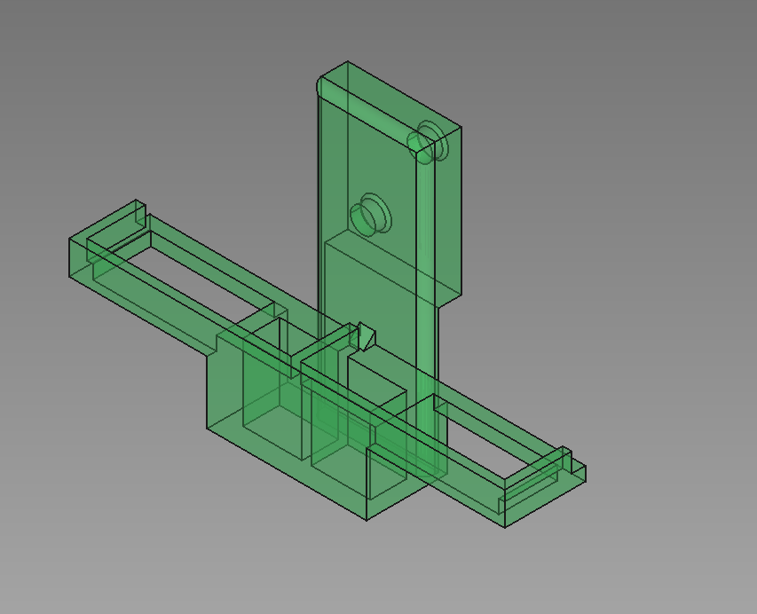
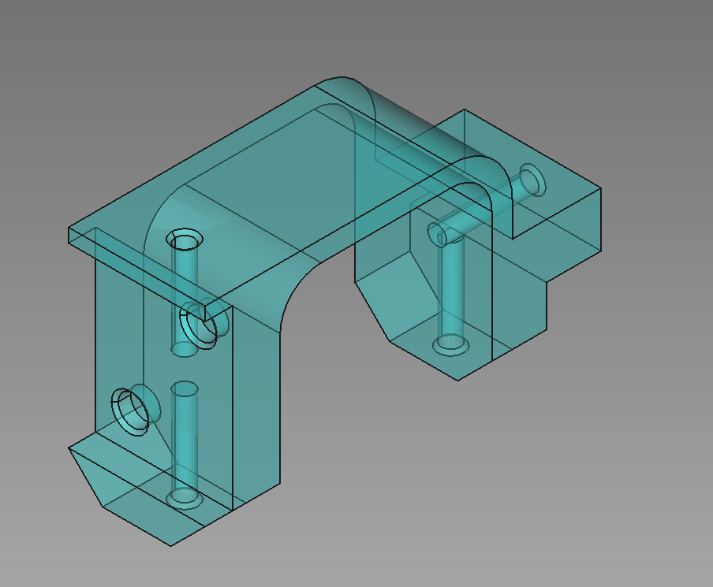
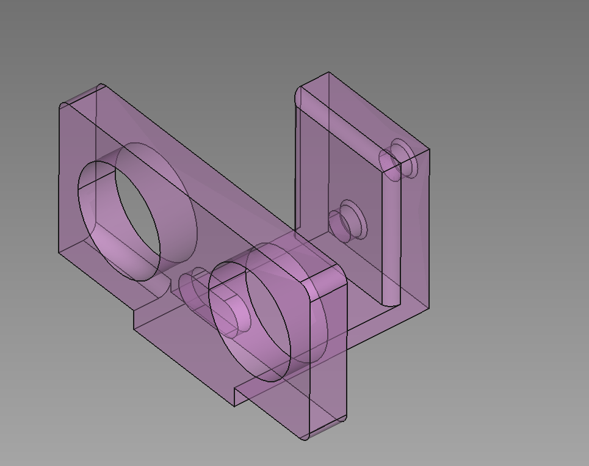

## Guía

He añadido tres piezas que puedes utilizar en tu escornabot: soporte para el sensor *HC-SR04*, otro para el sensor de IR *TCRT5000* y una modificación para el soporte de la batería que ya existía. He tenido en cuenta la tolerancia en la impresión 3D para que las piezas encajen perfectamente. Para que estas se queden fija he utilizado unos imanes de neodimio de *4x2mm* que encajan bien.

Imágenes:

